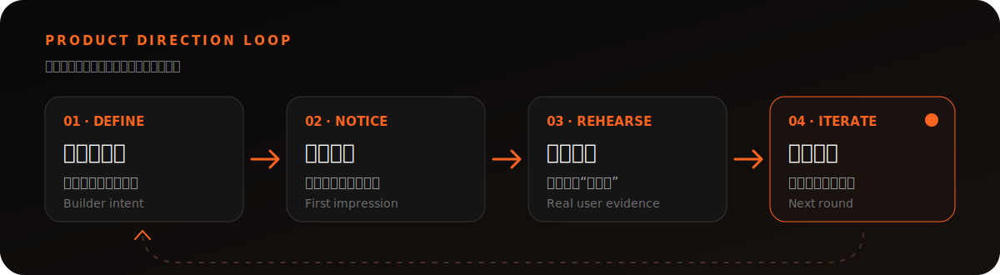

<div align="center">

<sub>AI BUILDERS · TOOLKIT 02</sub>

# 验证 AI 产品方向

**让 AI 整理判断，让真实用户提供证据，让 Builder 做最终取舍。**

<p>
  <a href="https://agentskills.io/"></a>
  <a href="https://config.figma.com/san-francisco/session/8f2835f5-9701-4834-9237-0621882953fa/"></a>
  
</p>

<a href="https://www.youtube.com/watch?v=lr7jom1NHzg">
  
</a>

<p>
  <a href="https://www.youtube.com/watch?v=lr7jom1NHzg"><strong>观看原演讲</strong></a>
  &nbsp;·&nbsp;
  <a href="skills/ai-builder-director/SKILL.md">查看 Skill</a>
  &nbsp;·&nbsp;
  <a href="skills/ai-builder-director/references/method-cards.md">打开方法卡</a>
  &nbsp;·&nbsp;
  <a href="#关注创作者">Elisedai在创造</a>
</p>

</div>

---

AI 已经可以很快做出一个“能用”的产品。这个 Skill 处理的是更难的部分：**你为什么留下这个方案，用户第一眼是否接收到你的意图，以及真实使用是否成立。**

它不是一组让 AI 扮演用户的提示词，而是一套把 Builder 判断、真实用户证据和下一轮迭代连接起来的工作流。

## 你会得到什么

| 01 · 定方向 | 02 · 验证第一眼 | 03 · 观察真实使用 |
| :--- | :--- | :--- |
| 写出一条真正能拒绝方案的**产品主心骨** | 用**五秒第一印象测试**检查意图是否被接收 | 用三个“第一次”记录真实行为，而不是收集空泛偏好 |
| 明确愿意坚持什么、放弃什么 | 找到预期与实际理解的最大差距 | 决定保留、修改呈现，还是重新检查产品原则 |

最终输出不是一份泛泛的分析报告，而是：**一个明确取舍、一组真实证据、下一轮只修改的一项内容。**

## 30 秒开始

把产品想法、页面截图、可点击原型或真实用户记录交给 Agent：

```text
使用 AI 产品方向验证 Skill，帮我明确这项产品的主心骨，
设计真实用户验证，并告诉我下一轮只应该修改什么。
```

Skill 会根据你当前所处的阶段，自动选择产品取舍、五秒测试、用户试用或证据整理，不强迫你从头走完整套流程。

## 一套可以反复运行的闭环

<p align="center">
  
</p>

> **真实用户不可替代。** AI 可以追问取舍、设计测试、整理证据和提出假设；它不能虚构用户反馈，也不能替 Builder 决定产品最终要相信什么。

## 安装

核心 Skill 位于 [`skills/ai-builder-director`](skills/ai-builder-director)。请复制整个目录，而不是只复制 `SKILL.md`，否则 Agent 无法读取完整方法卡。

<details>
<summary><strong>查看不同 Agent 的安装方式</strong></summary>

| 使用环境 | 安装位置 | 调用方式 |
| --- | --- | --- |
| 开放 Agent Skills | `.agents/skills/ai-builder-director/` | 自然语言或点名 Skill |
| Claude Code | `~/.claude/skills/ai-builder-director/` 或项目内 `.claude/skills/` | `/ai-builder-director` |
| OpenAI Codex | `~/.codex/skills/ai-builder-director/` | `$ai-builder-director` |
| 其他 Agent | 将整个目录加入 Agent 可读取的上下文 | 要求先读取 `SKILL.md` |

在 Codex 中也可以直接说：

```text
请使用 $skill-installer 安装这个 Skill：
https://github.com/Elisedai1013/ai-builders-toolkit-02-product-direction/tree/main/skills/ai-builder-director
```

内部调用名继续保留为 `ai-builder-director`，避免破坏已安装版本。

</details>

## 使用示例

<details>
<summary><strong>产品还在选方向</strong></summary>

```text
使用 AI 产品方向验证 Skill，帮我在这两个方案之间写出一条真正能指导取舍的产品主心骨。
```

</details>

<details>
<summary><strong>已经有页面或原型</strong></summary>

```text
使用 AI 产品方向验证 Skill，根据这张首页截图准备五秒第一印象测试。不要模拟用户回答。
```

```text
使用 AI 产品方向验证 Skill，把这个可点击原型变成一场 30 分钟的用户试用观察，并给我记录表。
```

</details>

<details>
<summary><strong>已经完成真实用户测试</strong></summary>

```text
使用 AI 产品方向验证 Skill，整理这 5 位真实用户的记录。
区分行为、原话和观察者推测，并告诉我下一轮只该验证什么。
```

</details>

## 方法来源

这个 Skill 源自「AI Builders 解读」第二期对 Kim Beverett 在 Config 2026 演讲 *Be the Director: How Stage Craft Informs Product Craft* 的转化与实践。

- [YouTube｜观看原演讲](https://www.youtube.com/watch?v=lr7jom1NHzg)
- [Config 2026｜官方演讲页面](https://config.figma.com/san-francisco/session/8f2835f5-9701-4834-9237-0621882953fa/)
- 演讲者：Kim Beverett，Product Manager at OpenAI

Kim 的核心启发是：当 AI 能迅速生成一个基本可用的产品，Builder 更需要像导演一样，有意识地决定用户看见什么、感受到什么，并把真实用户带进反复排练的过程。

本 Skill 将这一思路转化为「一句话取舍模板」「五秒第一印象测试」和「用户试用观察表」。这三个名称和具体模板由「AI Builders 解读 02」整理，并非原演讲中的正式命名。

## 关注创作者

<table>
  <tr>
    <td width="230" align="center">
      
    </td>
    <td>
      <h3>Elisedai在创造</h3>
      <p>关注微信视频号，持续获取 AI Builders 的一手内容、实践解读与可复用工具。</p>
      <p><strong>扫码关注 · 和 Builder 一起把想法做成真正成立的产品</strong></p>
    </td>
  </tr>
</table>

<details>
<summary><strong>仓库结构</strong></summary>

```text
assets/                            # README 视觉素材
skills/ai-builder-director/
├── SKILL.md                       # Agent 的触发条件、工作流与边界
├── agents/openai.yaml             # 可选：Codex 展示信息
└── references/method-cards.md     # 三张工具卡的详细模板与提示词
```

</details>

---

<div align="center">
  <sub>AI Builders 解读 02 · Build with intent. Rehearse with users.</sub>
</div>
